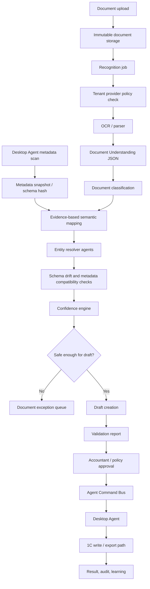

# AI Recognition and Agent Capabilities Guide

This guide defines the product and technical design for Automator's AI recognition capabilities and bounded recognition agents. It complements `ai-ocr-mapping.md`, `entity-resolution.md`, `review-workflow.md`, and `agent-command-bus.md`.

## Purpose

The AI recognition system turns uploaded business documents into safe, explainable draft proposals for 1C. Its core product function is to let Automator work with roughly **70-80% of typical and moderately customized 1C configurations without requiring a 1C programmer or integrator for every setup**. It reduces implementation work through automatic metadata scanning, evidence-based mapping, entity resolution, validation, correction learning, and drift detection.

This is a realistic coverage target, not a universal automation promise. Heavily customized 1C installations, missing metadata, unusual document flows, ambiguous catalogs, or tenant-specific accounting rules may still require implementation specialist work. The AI and agentic layer should make that boundary explicit by showing what was discovered, what was inferred from document evidence, what was validated, and what still needs human or administrator action.

Core rule:

```text
AI recognizes and proposes.
Validation checks.
Accountant or tenant policy approves.
Backend creates an explicit command.
Desktop Agent writes to 1C.
Backend records the result, audit trail, and learning feedback.
```

The recognition layer exists to:

- reduce programmer setup work for common and moderately customized 1C configurations;
- reuse Desktop Agent metadata scans as the main source of schema truth;
- parse documents, scans, photos, spreadsheets, and EDI payloads;
- classify document type and transaction intent;
- extract structured fields, line items, totals, parties, and source evidence;
- map extracted fields to a specific 1C metadata snapshot using evidence and explainable rules;
- resolve known 1C entities through candidate ranking;
- detect metadata drift that can invalidate prior mappings or automatic write eligibility;
- calculate confidence and review requirements;
- produce actionable explanations for accountants;
- create draft-ready proposals or route unsafe documents to exception handling.

The recognition layer must not:

- write directly to 1C;
- create, update, or delete 1C records;
- create agent commands by itself;
- approve drafts;
- hide uncertainty, low confidence, or validation warnings;
- store raw documents, full OCR text, secrets, or credentials in logs, queue payloads, public API responses, or audit payloads;
- introduce duplicate-document detection in the MVP.

Duplicate detection and reconciliation against existing 1C documents are explicitly out of MVP scope. The MVP must not produce duplicate-related statuses, warnings, queues, readiness caps, blocking decisions, or recognition fields such as `duplicateSuspected`.

## Product Coverage Strategy

Automator should be designed for broad practical coverage before bespoke integration work. The target is that a tenant with a typical or moderately customized 1C configuration can upload documents, scan metadata, receive mapped draft proposals, resolve known entities, pass validation, and submit approved writes without a 1C programmer building one-off mappings for every document type.

The AI and agentic layer reduces programmer setup work through six reinforcing capabilities:

- **Metadata scan:** The Desktop Agent discovers 1C catalogs, documents, fields, required flags, references, permissions, write paths, and schema hashes. Recognition treats this as the schema truth instead of relying on hand-authored integration assumptions.
- **Evidence-based mapping:** Extracted document fields are mapped to discovered 1C fields with source coordinates, confidence, alternatives, and reasons. The mapper must show why a field matched, not only the selected target.
- **Entity resolution:** Resolver agents rank existing counterparties, contracts, nomenclature, warehouses, organizations, and accounts using identifiers, fuzzy matching, tenant history, and correction memory.
- **Validation:** Required fields, data types, totals, VAT, units, metadata compatibility, permissions, and tenant policy decide whether the proposal can become a reviewable draft or must stop.
- **Learning:** Accountant corrections are stored as structured feedback so future mappings and resolver rankings improve without rewriting historical AI outputs.
- **Drift detection:** New metadata scans detect changed fields, references, required statuses, permissions, and write capabilities. Drift must block or downgrade automation until the affected mapping is revalidated.

This strategy should make pilot setup mostly a metadata and policy exercise for common configurations. Programmer or integrator work remains necessary when metadata is missing or misleading, the customer has custom business rules not inferable from documents, resolver candidates are unavailable, write paths are unsupported, or validation cannot prove safety.

## Safety Workflow

Recognition is one part of a larger safety workflow. Every step is tenant-scoped, idempotent where it mutates state, correlated by `correlationId`, and observable without exposing sensitive document content.



Safety requirements:

- Provider selection must respect the tenant OCR/LLM policy before any document content leaves the platform.
- A recent Desktop Agent metadata scan is the primary way to avoid custom programmer mapping for typical and moderately customized 1C configurations.
- Queue payloads contain identifiers and artifact references, not raw documents or full OCR text.
- OCR artifacts and document-understanding artifacts are stored separately from raw documents and draft records.
- Semantic mapping must reference a current `metadataSnapshotId` and `schemaHash`.
- Schema drift must downgrade or block automation when a previously known 1C object, field, required status, reference, or write capability changed.
- Low-confidence extraction, ambiguous entity resolution, metadata gaps, policy blocks, and validation failures must produce review items or exception records.
- Draft creation is not approval. New drafts start as `needs_review`, `approvalStatus: "pending"`, `writeStatus: "not_requested"`, and `requiresAccountantApproval: true`.
- Agent commands may be created only after approval and must include idempotency and a normalized payload.
- Recognition retries must not create duplicate drafts, duplicate artifacts, or duplicate audit events for the same idempotent operation.

## AI Recognition Layer

The AI recognition layer runs in backend-orchestrated worker jobs. It can use deterministic rules, OCR adapters, layout parsers, embeddings, and LLM-assisted extraction, but all outputs must be normalized into versioned JSON contracts before they affect drafts or validation.

### Components

- **Recognition Orchestrator:** Coordinates worker steps, idempotency, artifact reads/writes, retry policy, and failure routing.
- **Metadata Snapshot Consumer:** Loads Desktop Agent metadata scans, verifies schema hashes, and exposes discovered 1C structure to mapping and validation.
- **OCR / Parser Adapter:** Converts source documents into text blocks, tables, coordinates, quality metrics, and warnings.
- **Document Classifier:** Determines document type, transaction direction, and whether the type is supported.
- **Document Understanding Extractor:** Produces a normalized `DocumentUnderstandingV1` artifact with field evidence.
- **Semantic Mapper:** Maps extracted fields and tables to 1C metadata objects and fields for one `metadataSnapshotId`.
- **Entity Resolver Agents:** Rank candidates for counterparties, contracts, nomenclature, warehouses, organizations, and accounts.
- **Confidence Engine:** Combines OCR, mapping, resolver, validation, policy, and correction signals into review decisions.
- **Drift Detector:** Compares active mappings and drafts against the current metadata snapshot and blocks stale automation.
- **Explanation Composer:** Converts technical reasons into accountant-facing explanations without exposing raw internal diagnostics.
- **Learning Feedback Processor:** Stores accountant corrections as separate learning events without mutating original AI suggestions or audit history.

### Execution Rules

- Workers use BullMQ for asynchronous processing and PostgreSQL for source-of-truth state.
- Long-running OCR, classification, mapping, resolution, and validation must not execute inside HTTP request handlers.
- Recognition tools may read protected artifacts and metadata snapshots only through tenant-scoped services.
- Recognition agents must return structured outputs; free-form model text is not accepted as a draft input.
- Provider calls use strict timeouts, bounded retries, normalized error codes, and redacted diagnostics.
- A recognition failure must be recoverable as retry, exception routing, manual processing, or administrator setup.

## Document Understanding JSON

`DocumentUnderstandingV1` is the canonical structured recognition artifact. It is not the raw OCR provider artifact and not a draft. It captures extracted business meaning, source evidence, confidence, alternatives, and safety warnings in a stable shape that mapping, resolution, validation, review UI, and tests can consume.

The artifact is sensitive and must be stored in protected storage. API responses may expose selected field summaries to authorized users, but logs, queue payloads, public errors, and audit payloads must use references and counts instead of raw values.

### Recommended Shape

```json
{
  "payloadVersion": 1,
  "tenantId": "tenant_opaque_id",
  "documentId": "document_opaque_id",
  "correlationId": "trace_opaque_id",
  "source": {
    "mimeType": "application/pdf",
    "checksum": "sha256_hex",
    "originalFilenameRef": "protected_filename_ref",
    "pageCount": 3
  },
  "ocr": {
    "artifactRef": "ocr_artifact_storage_key",
    "provider": "local-paddleocr",
    "providerMode": "local",
    "providerVersion": "version_or_model_id",
    "quality": {
      "overallConfidence": 0.91,
      "warnings": ["skew_detected"]
    }
  },
  "classification": {
    "documentType": "supplier_invoice",
    "transactionDirection": "purchase",
    "confidence": 0.93,
    "alternatives": [
      {
        "documentType": "universal_transfer_document",
        "confidence": 0.61
      }
    ],
    "requiresReview": false
  },
  "fields": [
    {
      "fieldId": "field_document_number",
      "canonicalName": "documentNumber",
      "rawValue": "INV-2026-0042",
      "normalizedValue": "INV-2026-0042",
      "valueType": "string",
      "confidence": 0.96,
      "sourceRefs": [
        {
          "page": 1,
          "blockId": "block_18",
          "bbox": {
            "x": 0.62,
            "y": 0.13,
            "width": 0.21,
            "height": 0.03
          }
        }
      ],
      "alternatives": [],
      "warnings": []
    }
  ],
  "parties": [
    {
      "role": "supplier",
      "name": {
        "rawValue": "Example Supplier LLC",
        "normalizedValue": "example supplier",
        "confidence": 0.9
      },
      "taxIdentifiers": [
        {
          "kind": "inn",
          "rawValue": "7700000000",
          "normalizedValue": "7700000000",
          "valid": true,
          "confidence": 0.98
        }
      ],
      "sourceRefs": []
    }
  ],
  "lineItems": [
    {
      "lineId": "line_1",
      "description": {
        "rawValue": "Office paper A4",
        "normalizedValue": "office paper a4",
        "confidence": 0.9
      },
      "quantity": {
        "rawValue": "10",
        "normalizedValue": 10,
        "valueType": "decimal",
        "confidence": 0.95
      },
      "unit": {
        "rawValue": "pcs",
        "normalizedValue": "piece",
        "confidence": 0.87
      },
      "unitPrice": {
        "rawValue": "350.00",
        "normalizedValue": "350.00",
        "currency": "RUB",
        "confidence": 0.93
      },
      "sourceRefs": []
    }
  ],
  "totals": {
    "netAmount": {
      "rawValue": "3500.00",
      "normalizedValue": "3500.00",
      "currency": "RUB",
      "confidence": 0.94
    },
    "vatAmount": {
      "rawValue": "700.00",
      "normalizedValue": "700.00",
      "currency": "RUB",
      "confidence": 0.92
    },
    "grossAmount": {
      "rawValue": "4200.00",
      "normalizedValue": "4200.00",
      "currency": "RUB",
      "confidence": 0.94
    }
  },
  "safety": {
    "requiresReview": false,
    "warnings": [],
    "unsupportedReasons": []
  },
  "createdAt": "2026-06-02T00:00:00.000Z"
}
```

### Artifact Rules

- `payloadVersion` is required and must be versioned on breaking schema changes.
- Coordinates are normalized to page-relative `0.0` to `1.0` values.
- `fieldId`, `lineId`, and `blockId` are stable within one artifact and deterministic for equivalent parser output where practical.
- Raw extracted values are allowed only in protected artifacts and authorized review payloads. They are forbidden in logs and audit payloads.
- `normalizedValue` must preserve type intent. Dates, money, quantities, and tax identifiers require explicit normalization results instead of silent coercion.
- Financially critical values require source evidence or review.
- Missing, empty, malformed, low-confidence, or conflicting fields must be represented explicitly.
- The artifact must not include duplicate-document detection fields in MVP.

## Semantic Mapping

Semantic mapping transforms `DocumentUnderstandingV1` into a 1C draft proposal for a specific metadata snapshot. It is the bridge between extracted business meaning and the customer's actual 1C schema.

Inputs:

- `tenantId`;
- `documentId`;
- `metadataSnapshotId`;
- `schemaHash`;
- `DocumentUnderstandingV1` artifact reference;
- tenant mapping rules and correction memory;
- selected document type and transaction direction.

Outputs:

- target 1C resource name and object kind;
- mapped fields with source field references;
- mapped references that need entity resolution;
- unmapped required fields;
- unsupported or stale metadata reasons;
- mapping confidence and explanations;
- validation handoff data for draft creation.

Mapping rules:

- A mapping result is invalid without `metadataSnapshotId` and `schemaHash`.
- The mapper must verify that target resource names and fields exist in the metadata snapshot.
- Required 1C fields must be mapped, defaulted by explicit tenant rule, or marked as review-blocking.
- Unknown fields, incompatible data types, unsafe numeric conversion, or missing metadata must produce typed mapping errors.
- Field and reference names are treated as sets for idempotency: normalize, reject duplicates, and sort before hashing.
- LLM suggestions may propose mappings, but deterministic metadata validation decides whether the proposal is accepted.
- Mapping suggestions cannot create 1C entities, write packages, agent commands, or approvals.

Example mapping field shape:

```json
{
  "sourceFieldId": "field_document_number",
  "targetResourceName": "Document.PurchaseInvoice",
  "targetFieldName": "Number",
  "targetType": "string",
  "normalizedValue": "INV-2026-0042",
  "confidence": 0.96,
  "reasons": ["exact_field_label_match", "document_type_template_match"],
  "requiresReview": false
}
```

## Entity Resolver Agents

Entity resolver agents rank existing 1C candidates. They are advisory workers, not autonomous database actors. They never create counterparties, contracts, nomenclature items, warehouses, accounts, write commands, or 1C records.

Common output shape:

```json
{
  "entityType": "counterparty",
  "sourceRef": "party_supplier",
  "candidates": [
    {
      "candidateId": "one_c_ref_or_catalog_id",
      "displayName": "Example Supplier LLC",
      "score": 0.98,
      "matchReasons": ["exact_inn_kpp"],
      "warnings": [],
      "requiresReview": false
    }
  ],
  "selectedCandidateId": "one_c_ref_or_catalog_id",
  "requiresReview": false,
  "resolutionConfidence": 0.98
}
```

### Counterparty Resolver Agent

Signals:

- exact INN + KPP;
- exact INN;
- EDI identifier;
- bank account identifier where available;
- normalized legal-name similarity;
- address and communication hints;
- correction history for the tenant.

Rules:

- Exact identifiers dominate fuzzy names.
- Invalid INN or KPP values require review.
- Exact INN with a significantly different legal name is a severe warning.
- Name-only matches are capped and cannot bypass review below the configured threshold.
- Empty candidate lists require review or exception routing.

### Contract Resolver Agent

Signals:

- selected counterparty;
- contract number;
- contract date and active period;
- organization ownership;
- currency;
- transaction type compatibility;
- correction history.

Rules:

- Contract matching depends on the resolved counterparty.
- Inactive, wrong-organization, wrong-currency, or wrong-document-type contracts require review.
- If no safe contract can be selected, the draft remains review-blocked.

### Nomenclature Resolver Agent

Signals:

- barcode;
- supplier-specific item code;
- vendor code;
- SKU;
- normalized product-name similarity;
- unit compatibility;
- supplier correction history.

Rules:

- Exact product identifiers dominate fuzzy names.
- Barcode matches are valid only for accepted GTIN/UPC/EAN lengths.
- Unit mismatch always requires review and caps confidence.
- Supplier-specific aliases need supporting context and cannot be the only review-free reason.
- Empty candidate lists require review.

### Warehouse, Organization, and Account Resolver Agents

Signals:

- tenant and organization defaults;
- metadata snapshot references;
- document type and operation direction;
- delivery address;
- warehouse ownership;
- chart-of-accounts compatibility;
- historic user corrections.

Rules:

- Any resolver that affects accounting, tax, or inventory movement must fail closed on ambiguity.
- Tenant defaults must be explicit and auditable.
- Resolver outputs must include alternatives and reasons, not only the top candidate.

## Confidence Engine

The confidence engine converts multiple signals into document-level, field-level, mapping-level, and entity-level decisions. It must be deterministic for the same inputs and must not rely on an opaque model probability as the only signal.

Signal categories:

- OCR quality and parser confidence;
- document classifier confidence;
- source evidence quality and coordinates;
- exact identifiers such as INN, KPP, barcode, vendor code, SKU, and account number;
- fuzzy string similarity;
- embedding similarity as an auxiliary signal;
- metadata compatibility;
- required-field completeness;
- validation warnings and errors;
- tenant policy;
- prior accountant corrections;
- resolver ambiguity and candidate spread.

Decision outputs:

- `confidenceScore`: calibrated `0.0` to `1.0`;
- `confidenceTier`: `high`, `medium`, `low`, or `blocked`;
- `requiresReview`: boolean;
- `blockingReasons`: normalized reason codes;
- `warningReasons`: normalized reason codes;
- `reviewChecklist`: accountant-facing action list;
- `explanation`: concise explanation safe for UI display.

Confidence rules:

- Severe validation warnings force review regardless of score.
- Exact identifiers can raise confidence only when they do not conflict with other critical evidence.
- Fuzzy or embedding-only matches cannot auto-approve financially significant fields.
- Unit mismatch, missing conversion coefficients, VAT mismatch, stale metadata, unsupported document type, and tenant policy blocks must prevent automatic progression.
- User confirmation can increase future confidence only through structured learning feedback.
- Threshold options may be made stricter by tenant policy, but hard safety caps must not be weakened.

## Agentic Workflow

Recognition agents are bounded workers with explicit tools, typed inputs, typed outputs, and no independent authority to mutate 1C. The workflow is agentic in orchestration and reasoning, not in unchecked side effects.

Recommended workflow:

1. `RecognitionOrchestrator` receives a `documentId`, `tenantId`, `metadataSnapshotId`, `idempotencyKey`, and `correlationId`.
2. It acquires or verifies an idempotent processing record for the document and stage.
3. It checks tenant provider policy and loads only artifact references needed for the next step.
4. It runs OCR or parser adapters and stores the raw provider artifact under a protected key.
5. It creates `DocumentUnderstandingV1` and stores it as a separate protected artifact.
6. It classifies the document and checks whether the type is supported.
7. It maps fields to the target metadata snapshot.
8. It invokes resolver agents with bounded candidate sets supplied by tenant-scoped backend services.
9. It computes confidence, review items, and explanations.
10. It creates either a draft proposal through the draft creation contract or a compact document exception through the exception queue contract.
11. It records audit events with identifiers, counts, reason codes, stage names, and request hashes, never raw OCR text or full extracted values.
12. It stores correction-learning candidates only after human corrections or approvals occur.

Failure handling:

- Provider timeout: retry with bounded backoff when policy allows.
- Provider policy block: route to local fallback or manual processing.
- Malformed OCR output: store normalized parser error and route to OCR retry or manual processing.
- Unsupported document type: route to manual processing.
- Missing metadata snapshot: route to administrator setup.
- Stale `schemaHash`: request metadata rescan or block draft creation.
- Resolver ambiguity: create review item or document exception.
- Validation failure: keep draft recoverable and review-blocked.

Concurrency and retry rules:

- Stage-level writes must use idempotency keys.
- Processing retries must replay to the same artifact, draft, or exception state where possible.
- The recognition orchestrator must not dispatch write commands.
- Unknown write outcomes are handled by the Agent Command Bus and Desktop Agent, not by recognition agents.

## Tool and Action Design

Recognition tools must be small, typed, allowlisted, and categorized by side-effect level.

### Read and Compute Tools

These tools are safe to call during recognition when tenant authorization and policy checks pass:

- `loadDocumentReference(documentId)`;
- `loadOcrArtifact(artifactRef)`;
- `loadMetadataSnapshot(metadataSnapshotId)`;
- `loadTenantRecognitionPolicy(tenantId)`;
- `classifyDocument(documentUnderstandingRef)`;
- `extractDocumentUnderstanding(ocrArtifactRef)`;
- `mapToMetadataSnapshot(documentUnderstandingRef, metadataSnapshotId)`;
- `resolveCounterparty(extractedParty, candidateSetRef)`;
- `resolveContract(extractedContract, resolvedCounterpartyId, candidateSetRef)`;
- `resolveNomenclature(lineItem, candidateSetRef)`;
- `resolveWarehouse(documentContext, candidateSetRef)`;
- `computeConfidence(recognitionContext)`;
- `buildReviewExplanation(confidenceReport)`.

Read and compute tools must return typed JSON, normalized errors, and bounded arrays.

### Controlled Mutation Actions

These actions are allowed only through backend services with DTO validation, idempotency, authorization, and audit:

- persist OCR artifact reference;
- persist document-understanding artifact reference;
- persist recognition stage status;
- create document exception through `POST /api/document-exceptions`;
- create draft proposal through `POST /api/drafts`;
- append compact audit event;
- store learning feedback after accountant correction.

### Forbidden Recognition Actions

Recognition agents and model prompts must not have tools that can:

- execute 1C writes;
- create Agent Command Bus write commands;
- invoke the Desktop Agent directly;
- run shell commands or local processes;
- access 1C credentials;
- mutate 1C catalogs or documents;
- write direct SQL into 1C;
- approve drafts;
- bypass validation;
- edit immutable audit events;
- perform duplicate-document detection in MVP.

## Public Interfaces

Recognition interfaces should be versioned in shared contracts before implementation. Public API responses must expose only data needed by authorized users and must avoid leaking raw OCR text, secrets, credentials, internal diagnostics, or unrelated tenant data.

### Existing Handoff Interfaces

- `POST /api/drafts`: persists a draft proposal for accountant review. Recognition may prepare the payload, but the endpoint enforces draft-only behavior and must return pending review statuses.
- `POST /api/document-exceptions`: stores compact exception routing when recognition cannot safely continue.
- `POST /api/agents/commands`: exists for backend-to-Desktop-Agent command creation after approval. Recognition must not call it.

### Recommended Recognition Contract Types

- `RecognitionJobRequestV1`: `tenantId`, `documentId`, optional `metadataSnapshotId`, `idempotencyKey`, `correlationId`.
- `OcrArtifactRefV1`: provider metadata, storage key, quality metrics, warning codes.
- `DocumentUnderstandingV1`: structured extracted document meaning and evidence.
- `DocumentClassificationV1`: document type, alternatives, confidence, support status.
- `SemanticMappingSuggestionV1`: target metadata object, mapped fields, references, gaps, reasons.
- `EntityResolutionReportV1`: resolver outputs, ranked candidates, warnings, selected candidate when safe.
- `ConfidenceReportV1`: confidence scores, tiers, blocking reasons, review checklist.
- `RecognitionStageResultV1`: stage status, artifact refs, normalized errors, retryability, timestamps.

### API and Queue Rules

- API identifiers are opaque strings: `tenantId`, `documentId`, `draftId`, `metadataSnapshotId`, `correlationId`, `jobId`.
- Queue payloads use references only: `tenantId`, `documentId`, `metadataSnapshotId`, `idempotencyKey`, `correlationId`.
- Large artifacts live in object storage or protected database storage, not Redis.
- List endpoints for candidates or review items must paginate and enforce tenant scope.
- Error responses use normalized codes, severity, retryability, user action, and correlation ID.
- Contract examples must not include real customer data.

## Tests

Recognition tests should cover correctness, safety, determinism, and privacy.

### Unit Tests

- OCR artifact normalization for empty pages, malformed pages, skew warnings, table extraction, and missing coordinates.
- Document classification for supported and unsupported document types.
- `DocumentUnderstandingV1` schema validation, including missing required fields and invalid value types.
- Field normalization for dates, money, quantities, tax identifiers, and units.
- Semantic mapping against complete, missing-field, stale, and incompatible metadata snapshots.
- Resolver scoring for exact identifiers, invalid identifiers, fuzzy-only matches, ambiguous candidates, unit mismatch, empty candidates, and deterministic tie ordering.
- Confidence engine rules for severe warnings, threshold caps, policy blocks, and review requirements.

### Contract Tests

- DTO validation rejects unknown fields, forbidden lifecycle/write fields, duplicate field names, large arrays, malformed IDs, and unsafe correlation IDs.
- Draft creation payloads are order-independent for idempotency hashing.
- Document exception payloads store only compact signals and reject raw OCR text or secret-like values.
- Public responses do not echo sensitive extracted values in errors.
- Recognition contract versions are additive unless explicitly migrated.

### Integration Tests

- Recognition jobs persist state in PostgreSQL and use BullMQ only for orchestration.
- Provider timeouts retry with bounded backoff and terminal errors route to exception handling.
- Tenant policy blocks cloud provider usage when only local processing is allowed.
- Metadata gaps route to administrator setup instead of creating unsafe drafts.
- Low-confidence or ambiguous documents route to review or exception handling.
- Recognition cannot create Agent Command Bus write commands before approval.

### Golden and Fixture Tests

- Golden OCR artifacts for invoices, acts, waybills, UPDs, spreadsheets, and EDI payloads.
- Golden `DocumentUnderstandingV1` fixtures for each supported document type.
- Golden metadata snapshots for standard and modified 1C configurations.
- Mapping fixtures for required fields, custom fields, missing fields, and schema drift.
- Entity resolver fixtures for counterparties, contracts, nomenclature, warehouses, and accounts.
- Negative fixtures proving no duplicate-detection fields, signals, review reasons, or queues exist in MVP.

### Privacy and Observability Tests

- Logs and traces include correlation IDs, stage names, durations, retry counts, and normalized error codes.
- Logs, queue payloads, audit payloads, and API errors do not include raw documents, full OCR text, secrets, credentials, connection strings, or raw 1C diagnostics.
- Diagnostic references are redacted and access-controlled.
- Cross-tenant artifact, metadata, embedding, and candidate access is rejected.

## Assumptions

- MVP recognition focuses on safe draft proposals, not fully autonomous posting.
- Metadata snapshots exist before semantic mapping can create a draft-ready proposal.
- Candidate sets for resolver agents are supplied by tenant-scoped backend services; resolvers do not query 1C directly.
- Cloud OCR, cloud LLM, and cloud embeddings are optional and always gated by tenant policy.
- Local or self-hosted processing remains the fallback for tenants that prohibit cloud processing.
- Embeddings are auxiliary signals and cannot independently approve financially significant mappings.
- Accountant corrections are stored as learning feedback and do not rewrite original AI outputs or immutable audit events.
- Draft creation leaves work in review by default; approval and command creation are separate later transitions.
- Duplicate-document detection, reconciliation against existing 1C documents, and duplicate-related readiness logic are not part of the MVP.
