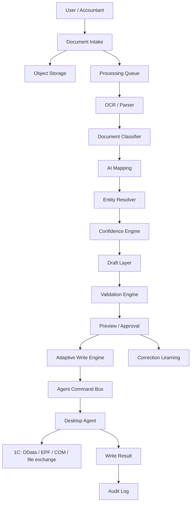
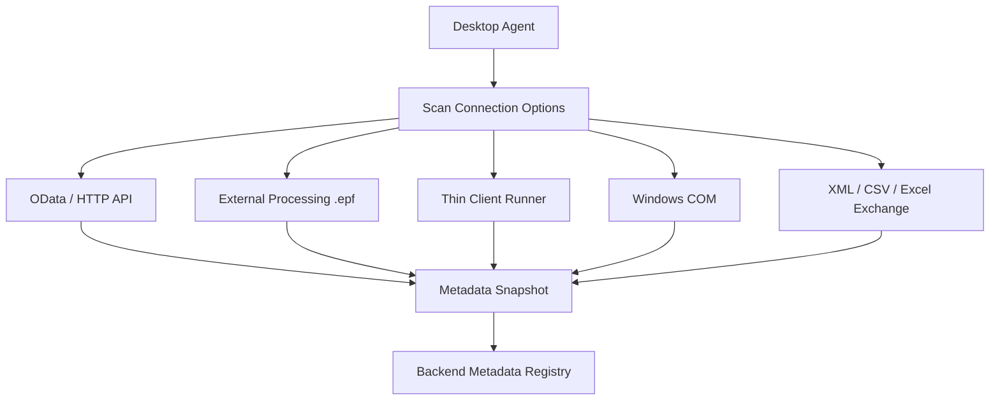

# Automator Architecture

Automator is a platform designed for the secure loading of documents into 1C using OCR/AI recognition, entity resolution, drafts, validation, and controlled writing via a local desktop agent.

The primary architectural principle is:

```text
AI proposes.
Validation checks.
Accountant or policy confirms.
Desktop Agent performs the write in 1C.
Backend persists the result and audit log.
```

AI does not write directly to 1C. Any write operation must pass through the draft layer, validation engine, approval policy, and adaptive write engine.

## General Design



## The Three Main Components

### 1. Desktop Agent

The Desktop Agent is a local application running on the client machine. It functions as a bridge to 1C, not the "brain" of the product.

Stack:

- **Rust** for system logic, OS integration, local queue, secrets, helper process spawning, and 1C writing.
- **Tauri** as the desktop runtime and IPC bridge between the React UI and the Rust core.
- **React** as the UI for onboarding, integration status, manual confirmations, conflict resolution, and diagnostics.

Agent Responsibilities:

- Connecting to local, server, or Fresh (cloud) 1C databases.
- Verifying available integration methods (capability matrix).
- Reading 1C metadata and sending normalized metadata snapshots to the backend.
- Secure local storage of secrets.
- Maintaining a local outbox/inbox queue for robust offline-safe operations.
- Receiving and executing commands from the backend.
- Executing write, export, or draft-creation tasks in 1C.
- Returning results, errors, and diagnostic events.
- Interacting with OData, external processing (.epf), thin client, COM on Windows, and file exchange.

The Agent MUST NOT:

- Make product-level decisions regarding mapping.
- Independently interpret the business meaning of a document.
- Perform heavy AI or OCR logic.
- Write to 1C without backend instruction and a validated draft.
- Retain more data than necessary for local queue operations and transient processing.

### 2. Backend Platform

The Backend Platform is the central control plane and orchestration system of the product.

Stack:

- **TypeScript + NestJS** for APIs and orchestration.
- **PostgreSQL** for tenant data, documents, metadata snapshots, drafts, audit logs, and state machines.
- **Redis + BullMQ** for background job queues in MVP.
- **S3-compatible Object Storage** for raw documents and OCR artifacts.
- **TypeScript workers** for OCR orchestration, mapping, validation, and write orchestration.
- **OpenTelemetry/Sentry-compatible telemetry** for diagnostics.

Backend Responsibilities:

- Managing users, organizations, and tenant configurations.
- Handling agent enrollment and machine identity.
- Processing document intakes.
- Managing job queues.
- Orchestrating OCR and AI pipelines.
- Running document classification.
- Generating AI mapping suggestions.
- Performing entity resolution.
- Computing confidence scores.
- Maintaining the draft layer and state machine.
- Operating the validation engine and approval workflows.
- Selecting the adaptive write strategy.
- Keeping the immutable audit log.
- Processing learning feedback from accountant corrections.
- Enforcing integration policies and security rules.

The Backend decides:

- What text and tables have been recognized.
- What document type is being processed.
- Which 1C metadata objects the extracted fields should map to.
- The overall confidence level of the matching.
- Whether it is safe to write to 1C automatically.
- Which write strategy should be used.
- When manual human review is mandatory.

### 3. AI / OCR / Mapping Layer

The AI layer is strictly advisory, reducing manual setup overhead while having no direct write permissions.

Its product target is to let Automator work with roughly **70-80% of typical and moderately customized 1C configurations without a 1C programmer or integrator for every setup**. That target depends on automatic metadata discovery, evidence-based semantic mapping, resolver agents, validation, correction learning, and drift detection. The detailed product and technical design is defined in [ai-recognition-agents.md](/Users/vital/Documents/automator/docs/ai-recognition-agents.md).

This layer includes:

- **OCR / Document Parser** for PDFs, scans, photos, Excel sheets, and EDI payloads.
- **Document Classifier** to detect the transaction type.
- **Field Extractor** to extract key attributes from text.
- **AI Mapping Engine** to map extracted fields to 1C objects and schemas.
- **Entity Resolver** for counterparties, contracts, items (nomenclature), warehouses, and chart of accounts.
- **Confidence Engine** to assign quality scores.
- **Explanation Generator** for explaining low-confidence mappings.
- **Correction Learning** to capture human overrides and update models.

Core Pipeline Rule:

```text
AI Output -> Draft -> Validation -> Approval -> Write Command
```

## Document Processing Pipeline

Each document progresses through a resilient, step-by-step pipeline. Every step must be idempotent, repeatable, and observable.

```text
UploadedDocument
  -> StoredDocument
  -> OcrResult
  -> DocumentClassification
  -> ExtractedFields
  -> MappingSuggestion
  -> ResolvedEntities
  -> ConfidenceReport
  -> Draft
  -> ValidationReport
  -> ApprovalDecision
  -> WriteCommand
  -> WriteResult
  -> AuditEvent
```

Key Requirements:

- The original document is stored separately from processing results and must never be mutated.
- OCR and AI artifacts are versioned.
- Every step records its status, errors, and retry metadata.
- All external calls must have strict timeouts, retry policies, and clear failure states.
- Re-processing a document must never create duplicate objects.
- Writing to 1C is strictly driven by idempotent write commands.
- Accountant corrections are captured and stored separately from the original AI-suggested values.

## 1C Connection Flow

The Desktop Agent scans available connection methods on startup to assemble a capability matrix.



The system must detect:

- The 1C configuration type and version.
- Platform version.
- Discovered catalogs and documents.
- Detailed field structures and mandatory fields.
- References and relationships between objects.
- Active permissions of the user context.
- Available read and write paths.
- Limitations of the current environment.
- Any schema drift compared to the previous snapshot.

The metadata snapshot is a first-class entity. All mapping, validation, and write decisions must reference a specific `metadataSnapshotId`.

## Metadata Snapshot Structure

A metadata snapshot contains a normalized map of the 1C instance:

- Tenant ID.
- Agent ID.
- Connection profile ID.
- Platform and configuration versions.
- Lists of discovered catalogs and documents.
- Full field catalogs, data types, and required statuses.
- References and enumerations.
- Supported write paths and permissions.
- Schema hash/checksum.
- Generation timestamp (`collectedAt`).

The snapshot is critical for AI mapping, entity resolution, validation, config drift detection, selecting write strategies, and explaining why fields cannot be written automatically.

## Draft Layer

The Draft is the central state machine between raw AI output and the 1C database.

A Draft contains:

- Document reference and type.
- Metadata snapshot ID.
- Extracted raw fields.
- AI mapping suggestions and resolved entities.
- Confidence and validation reports.
- Accountant overrides and corrections.
- Approval status.
- Write strategy.
- Final write results.

Draft States:

```text
created
  -> processing
  -> needs_review
  -> validated
  -> approved
  -> write_pending
  -> written

failed
write_failed
export_required
cancelled
```

Rules:

- `written` is unreachable without transitioning through `approved`.
- `approved` is unreachable without successful validation or an explicit, authorized override.
- Any disputed or low-confidence fields force the Draft into `needs_review`.
- Low confidence scores block any automated write actions.
- Validation errors must be highlighted and actionable in the accountant's UI.
- Every manual correction must feed back into the learning loop.

## Validation Engine

The Validation Engine evaluates whether it is safe to execute a write operation.

Checks include:

- Mandatory fields.
- Match of data types and limits.
- Date validity and open accounting periods.
- Financial arithmetic and tax/VAT consistency.
- Currency matching.
- Duplicate document checks.
- Verification of resolved counterparties, active contracts, matching inventory (nomenclature), and warehouses.
- User permission levels.
- Connection health and write path availability.
- Compliance with the current metadata snapshot.
- Tenant-specific rules and policy checks.
- Idempotency keys.

The validation report must be highly actionable, returning a structured format:

```text
field
severity (warning / error)
code
message
suggestedAction
canOverride (boolean)
```

## Adaptive Write Engine

The Adaptive Write Engine selects the safest and most efficient path to execute writes to 1C.

Supported Strategies:

- `ODataWriter`: Standard write through OData HTTP APIs.
- `EpfWriter`: Writing via external data processors (.epf).
- `ThinClientWriter`: Guided local workflow execution using the 1C thin client.
- `ComWriter`: Legacy Windows-only COM integration (Automation Server or external connection).
- `FileExchangeWriter`: Batch file importing (XML, CSV, Excel).
- `ManualExportWriter`: Generating an export package when automatic write is unsafe or blocked.

The selection depends on the agent capability matrix, active metadata snapshot, document type, tenant rules, confidence and validation scores, user permissions, and previous write attempts.

If automatic writing fails, the engine falls back gracefully:

```text
Automatic write failed/unsupported.
Proposed action: Generate import package or request manual mapping.
```

## Agent Command Bus

The backend does not query or write to 1C directly. It enqueues commands on the Agent Command Bus.

Core Commands:

- `ScanMetadata`
- `TestConnection`
- `CreateDraftIn1C`
- `WriteDocument`
- `ExportPackage`
- `RunExternalProcessing`
- `ValidateOneCObject`
- `RefreshCapabilities`
- `CollectDiagnostics`

A Command payload contains:

- Command ID and type.
- Tenant and Agent IDs.
- Idempotency key.
- Specific payload data.
- Execution deadline and retry policies.
- Required capabilities.
- Metadata (creator, creation time).

The Agent responds with:

- Command ID and execution status.
- Execution timing (`startedAt`, `finishedAt`).
- Write result details or normalized errors.
- Raw diagnostic references (if requested).
- A `retryable` flag.
- Audit metadata.

## Error Handling and Degradation

The system is designed with graceful degradation at every layer:

- OCR failure: Draft goes to `needs_review`.
- Entity resolver failure: Accountant selects the entity manually.
- Missing required fields: Clear validation error presented.
- OData offline: Write engine switches to EPF or generates a manual export package.
- Windows COM unavailable (e.g., on macOS): COM strategy is excluded from options.
- 1C Schema changed: Block write on affected fields and trigger metadata rescan.
- Write risks detected: Switch to manual export package generation.

Errors are normalized into a unified structure:

```text
code
message
severity
source (agent, backend, 1C)
retryable (boolean)
userAction
technicalDetailsRef
```

## Audit Log and Learning Loop

Every operation is logged in an append-only, tamper-proof Audit Log:

- Document upload, classification, and OCR outputs.
- Mapping suggestions and entity resolution attempts.
- Confidence reports and validation checks.
- Manual user overrides, corrections, and final approvals.
- Spawning of write commands and final outcomes.
- Fallback exports.

Audit logs strictly distinguish AI recommendations from human-made decisions.

The Learning Loop records user adjustments for model calibration:

- Selected counterparties, contracts, nomenclature, and warehouses.
- Corrected field values.
- Rejection of specific AI recommendations.
- Validated overrides.

The learning feedback operates in a separate database layer and must never modify historical audit logs.

## Monorepo Ownership Boundaries

```text
apps/
  desktop/      Tauri + Rust + React desktop-agent.
  api/          NestJS API/control plane.
  worker/       BullMQ workers for OCR, mapping, validation and orchestration.
packages/
  contracts/    Shared TypeScript contracts.
infra/          Postgres, Redis, object storage and local infrastructure.
docs/           Architecture, ADRs, security notes and roadmap.
```

### Desktop Modules:

- `agent`: Core agent state, health, capability matrix, and command execution boundary.
- `integrations/odata`: OData protocol, schema parsing, and write utilities.
- `integrations/epf_runner`: .epf file transfer and runtime execution checks.
- `integrations/thin_client`: Spawning 1C client executables.
- `integrations/windows_com`: Windows-only IDispatch and Automation connectors.
- `queue`: Persistent SQLCipher outbox/inbox queues.
- `security`: OS keyring, Stronghold integration, and local secrets manager.
- `telemetry`: Redacted logging, telemetry events, and system diagnostics.

### Backend Modules:

- `auth`: JWT/OIDC identity, PKCE native auth, and machine enrollment.
- `tenants`: Tenant configurations, data residency policies, and retention policies.
- `agents`: Enrollment, heartbeat tracking, capability monitoring, and command bus.
- `connections`: 1C connection credentials and profiles.
- `metadata`: Schema snapshots, diffing, and drift detection.
- `documents`: Document ingestion, storage references, and retention policy.
- `jobs`: Job queues, worker threads, and queue telemetry.
- `ocr`: OCR adapters and raw outputs.
- `classification`: Document classification engines.
- `mapping`: Semantic mapping rules.
- `resolvers`: Counterparty, contract, item, and warehouse resolvers.
- `confidence`: Unified confidence scoring.
- `drafts`: Draft lifecycle state machine.
- `validation`: Business logic constraints and schema checks.
- `write`: Adaptive write orchestration and failover.
- `audit`: Tamper-proof audit logs.
- `learning`: Correction storage and matching rule updates.

## MVP Limits and Boundaries

- Windows-first client focus.
- OData and EPF as primary write strategies.
- COM strictly as an isolated, limited fallback.
- File-based export packages as the ultimate write failover.
- Redis + BullMQ instead of a complex Temporal cluster.
- PostgreSQL as the primary transactional store.
- Mandatory metadata scanning and draft-first workflows from day 1.
- AI has zero direct execution privileges; everything runs through validation and command bus gates.

## Out of Scope

The following are strictly forbidden in this architecture:

- Direct database writes (SQL) to the 1C SQL backend.
- Autonomous write actions (no validation, draft, or approval bypass).
- General support for deeply modified 1C databases without target pilot hardening.
- Storage of database credentials in client-side React UI state.
- Embedded login webviews in the desktop agent UI (external browser + PKCE only).
- Mixing UI state with raw system-level 1C write functions.
