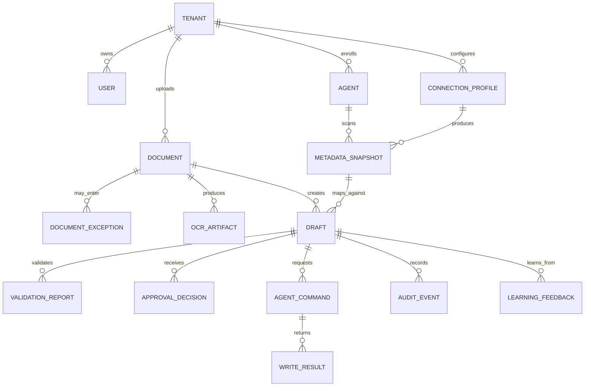

# Domain Model

This document defines the core product entities and ownership boundaries. It is intentionally technology-neutral except where storage or execution boundaries matter.

## Entity Overview



## Tenant

Represents a customer organization or isolated deployment boundary.

Owns:

- users;
- agents;
- connection profiles;
- documents;
- policies;
- retention settings;
- provider configuration.

Rules:

- Every business record must be tenant-scoped.
- Cross-tenant reads are forbidden unless a specific admin operation explicitly allows them.
- OCR/LLM execution policy is tenant-owned.

## User

Represents a human actor.

Typical roles:

- accountant;
- operator;
- tenant admin;
- support engineer;
- platform admin.

Rules:

- User actions that affect drafts, approvals, overrides, or writes must create audit events.
- User identity is not the same as agent machine identity.

## Agent

Represents an enrolled desktop-agent installation.

Tracks:

- agent id;
- tenant id;
- device identity;
- version;
- OS/platform;
- capabilities;
- update channel;
- online/offline status;
- last heartbeat.

Rules:

- Agent commands must target a specific enrolled agent.
- Agent capabilities must be current enough before write strategy selection.

## Connection Profile

Represents a configured 1C connection target.

Tracks:

- type: local, server, Fresh, or file exchange;
- endpoint references;
- authentication mode;
- available integration paths;
- policy constraints;
- last successful scan.

Secrets must not be stored directly in the profile record. Store only secure references.

## Metadata Snapshot

Represents the normalized schema and capability state discovered from 1C.

Tracks:

- configuration name and version;
- platform version;
- catalogs;
- documents;
- fields;
- required fields;
- references;
- enumerations;
- permissions;
- write capabilities;
- schema hash;
- collected timestamp.

Rules:

- Drafts and mappings must reference a metadata snapshot.
- Schema drift should invalidate affected automatic writes.

## Document

Represents the original uploaded input.

Tracks:

- tenant id;
- uploader;
- storage key;
- original filename;
- MIME type;
- checksum;
- size;
- ingestion source;
- processing status;
- retention policy.

Rules:

- Original documents are immutable.
- Raw document contents do not belong in logs or queue payloads.

## Document Exception

Represents a document that cannot safely continue through the normal automation path without human review, administrator setup, retry, or manual processing.

Tracks:

- tenant id;
- document id;
- optional draft id;
- optional metadata snapshot id and schema hash;
- processing stage;
- normalized exception signals;
- selected category;
- selected queue name;
- priority;
- open/review/resolved status;
- accountant/admin review flags;
- suggested actions;
- idempotency key;
- correlation id;
- creator id.

Initial state:

```text
status: open
```

Rules:

- Exception routing stores compact problem metadata in Automator PostgreSQL, not in 1C.
- Exception routing cannot create drafts, write packages, agent commands, or 1C-side records.
- The backend derives `category`, `queueName`, and `priority`; callers cannot choose them directly.
- Signals must describe reasons, not contain raw OCR text, raw documents, full extracted text, credentials, tokens, or connection strings.
- Every queued exception must append a `document.exception.queued` audit event in the same database transaction.
- Idempotency is scoped by `(tenantId, idempotencyKey)`.

## OCR Artifact

Represents parser output and normalized extraction artifacts.

Tracks:

- provider;
- provider version;
- execution mode;
- text blocks;
- layout blocks;
- tables;
- confidence metrics;
- warnings;
- artifact storage key.

Rules:

- OCR artifacts are sensitive.
- Provider selection must respect tenant policy.

## Draft

Represents a proposed 1C operation.

Tracks:

- document id;
- metadata snapshot id;
- document type;
- extracted fields;
- mapping suggestions;
- resolved entities;
- confidence report;
- validation status;
- approval status;
- write status;
- correction history.

Allowed lifecycle:

```text
created
  -> processing
  -> needs_review
  -> validated
  -> approved
  -> write_pending
  -> written

failed
write_failed
export_required
cancelled
```

Rules:

- Draft creation stores the proposal in Automator PostgreSQL, not in 1C.
- A newly persisted draft must start as `lifecycleStatus: "needs_review"`, `approvalStatus: "pending"`, `writeStatus: "not_requested"`, and `requiresAccountantApproval: true`.
- A draft cannot be written before approval.
- Draft creation cannot create write packages, agent commands, queue jobs, or 1C-side drafts.
- Draft creation normalizes mapped fields and references before idempotency hashing, rejects duplicates, and stores audit metadata without mapped values.
- Low-confidence fields require review or explicit policy.
- Corrections are stored separately from original AI suggestions.

## Validation Report

Represents safety and completeness checks.

Tracks:

- validation status;
- error/warning list;
- field-level messages;
- tax/VAT checks;
- required fields;
- permission checks;
- write path checks;
- override eligibility.

Rules:

- Validation report must be actionable.
- Validation must not mutate 1C.

## Agent Command

Represents a backend request for the desktop-agent to execute local work.

Common types:

- `ScanMetadata`;
- `TestConnection`;
- `WriteDocument`;
- `CreateDraftIn1C`;
- `ExportPackage`;
- `RunExternalProcessing`;
- `CollectDiagnostics`.

Rules:

- Every side-effecting command requires an idempotency key.
- Command execution belongs to the agent, but command creation belongs to backend policy.

## Write Result

Represents the outcome of agent execution.

Tracks:

- command id;
- status;
- selected write strategy;
- external 1C reference if created;
- normalized errors;
- retryable flag;
- started/finished timestamps.

Rules:

- Partial writes must be visible.
- Write errors must be normalized and auditable.

## Audit Event

Append-only record of significant actions.

Records:

- actor type;
- actor id;
- event type;
- subject type/id;
- timestamp;
- redacted payload;
- correlation ids.

Rules:

- Do not delete audit events as part of normal product behavior.
- Do not rewrite AI suggestions as human approvals.

## Learning Feedback

Represents human corrections that improve future matching.

Tracks:

- raw extracted value;
- rejected candidates;
- selected entity;
- user id;
- metadata snapshot id;
- document type;
- timestamp.

Rules:

- Learning feedback must not mutate historical audit records.
- Learning updates should be explainable and tenant-scoped.
